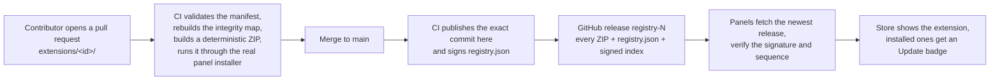

<div align="center">

# TendExtensions

**The public registry of extensions for [Tend](https://tend.host), the self-hosted server panel.**

[](LICENSE)
[](https://github.com/Tend-Stack/TendExtensions/releases)
[](#whats-in-the-registry)

Every extension lives here as plain source, in its own folder. A pull request adds one or updates one.
On merge, CI builds every package, signs the index, and publishes a release that every Tend panel
in the world can verify and install from, with no panel update in between.

</div>

---

## What is Tend?

[Tend](https://tend.host) is a self-hosted control panel for the servers you own. It deploys apps and
services from Git, runs them in containers, watches their health, and wraps the whole thing in a calm,
desktop-like shell: windows, a menu bar, a dock, widgets on a home shelf, and a small set of built-in
apps. Extensions are how that shell grows. A calculator, a note-taking tool, a game for a coffee break,
a dashboard for something you run: each one is a small ES-module package that the panel mounts in its
own window and talks to through a narrow host API.

Tend is available as **self-hosted** (you run the panel) and as **hosted** panels at
[tend.host](https://tend.host). Both read this registry the same way.

## What is an extension?

An extension is a folder with an `extension.json` manifest (schema 2) and the ES modules it declares.
The panel loads the entry module, calls `activate(host)`, and mounts what it returns in a
**tool window** or as a full **shell app**. Through `host` an extension gets exactly what it declared
in `permissions` and nothing else: key-value **storage**, **notifications**, the current **theme** and
**user**, and, for extensions that declare them, **files**, **media**, **documents**, and **sites**.
There is no outbound network from an extension; the panel's content-security policy enforces that.

Every file an extension ships is pinned in the manifest's **integrity map** (SHA-256). The panel refuses
a package whose bytes disagree with its manifest, and runs every package through its installer, its
integrity verifier, and its web application firewall before a single module executes.

```jsonc
// extensions/host.tend.calculator/extension.json (abridged)
{
  "schema": 2,
  "id": "host.tend.calculator",
  "name": "Calculator",
  "version": "3.0.0",
  "author": "tend.host",
  "description": "Seven-mode calculator …",
  "icon": "icon.svg",
  "ui": { "module": "index.js", "mount": "tool-window", "size": { "w": 460, "h": 700 } },
  "permissions": ["storage"],
  "integrity": { "index.js": "sha256-…", "engine/parser.js": "sha256-…" }
}
```

Next to the manifest, `listing.json` carries what the store shows but the runtime does not need:
publisher, category, feature bullets, requirements, and the release notes for the current version.

## What's in the registry

| Extension | Version | Category | What it is |
|---|---|---|---|
| **Calculator** (`host.tend.calculator`) | 3.0.0 | productivity | Standard, scientific, graphing, programmer, statistics, financial and converter modes, a real expression engine, a history tape, full keyboard control |
| **Riftwing: Skybound** (`com.tendstack.riftwing`) | 4.1.1 | games | A fast, replayable sky-runner with eight worlds and nine pilots |
| **2048 Odyssey** (`host.tend.2048`) | 2.0.1 | games | Merge mastery across an endless target ladder |
| **Breakout Odyssey** (`host.tend.breakout`) | 2.2.0 | games | Campaign Breakout with boss walls and live relayout |
| **Cookie Empire Odyssey** (`host.tend.cookie`) | 2.2.0 | games | An active-idle bakery with upgrades and prestige |
| **Fruit Slash Odyssey** (`host.tend.fruitninja`) | 2.2.0 | games | Fruit-slicing arcade action |
| **Gem Crush Odyssey** (`host.tend.gemcrush`) | 3.0.4 | games | An 80-stage match-three campaign |
| **Match Puzzle: Odyssey** (`host.tend.matchpuzzle`) | 2.1.1 | games | A polished match puzzle adventure |
| **Memory Match Odyssey** (`host.tend.memory`) | 2.2.0 | games | A 50-stage memory campaign |
| **Minesweeper Odyssey** (`host.tend.minesweeper`) | 3.0.2 | games | A no-guess Minesweeper expedition |
| **Neon Cyber-Man** (`host.tend.neon-cyber-man`) | 1.0.1 | games | A cyberpunk maze-chase arcade game with adaptive ghost AI |
| **Peggle Odyssey: Arc Light** (`host.tend.peggle`) | 3.0.6 | games | Arcade ricochet with fever shots and star-rated stages |
| **Simon Odyssey: Neural Pulse** (`host.tend.simon`) | 3.0.3 | games | A 60-session brain-training campaign |
| **Snake Odyssey: Neon Wilds** (`host.tend.snake`) | 3.1.1 | games | Modern Snake with endless classic growth |
| **Solitaire Odyssey: Starlight Circuit** (`host.tend.solitaire`) | 3.0.1 | games | Klondike with fluid card dragging and 36 stages |
| **Sudoku** (`host.tend.sudoku`) | 1.1.0 | games | Classic 9×9 Sudoku |
| **Tetris** (`host.tend.tetris`) | 3.1.0 | games | The classic, rebuilt with keyboard and touch controls |
| **Word Guess** (`host.tend.wordle`) | 1.1.0 | games | Guess the hidden word in six tries |

The table is a snapshot; `dist/registry.json` built from `main` is always the authority.

## How an extension reaches a panel



- **The index is signed.** `tend-extension-registry-v1.json` is an Ed25519-signed envelope. Panels pin the
  registry's public key and refuse anything unsigned, tampered, expired, or older than what they last
  verified (`sequence` only ever increases).
- **Every package is pinned.** The signed index carries each ZIP's name, size, and SHA-256. Download URLs
  are never in the file; a panel derives them from the release tag, so the signature always guards the
  bytes it will install.
- **Builds are reproducible.** `tools/build.py` produces byte-identical ZIPs from the same source, and CI
  refuses a pull request whose package the panel's own installer would reject.
- **Panels stay in control.** The registry is opt-in per panel (Settings → Extensions), checks every six
  hours by default, and only ever *offers* an update. Installing still runs the panel's integrity verifier
  and firewall, and a rollback is one click away.

## For panel users

Open **Settings → Extensions** in your Tend panel. Leave the registry enabled and the panel checks for
new extensions and updates on its own, notifying you once per new set. "Check now" asks immediately.
Installed extensions with a newer registry version show **Update available** in the store, with
**Update all** beside it. If you would rather freeze what you have, turn the registry off; the extensions
bundled with your panel keep working exactly as before.

## Contributing

We would love your extension here. The full guide is in [CONTRIBUTING.md](CONTRIBUTING.md); the short
version:

**Add a new extension**

1. Fork this repository and create `extensions/<your.extension.id>/`. Ids are reverse-DNS
   (`com.example.weather`); `host.tend.*` and `com.tendstack.*` are reserved for first-party work.
2. Write `extension.json` (schema 2) and your ES modules. Declare only the permissions you use.
3. Write `listing.json`: publisher, category, three to six feature bullets, requirements, release notes.
4. Build locally and let the tooling rebuild your integrity map:
   ```bash
   pip install -r tools/requirements.txt
   python tools/build.py
   ```
5. Open a pull request. CI validates the manifest, checks the build is reproducible, and runs your
   package through the real panel installer. A maintainer reviews the code, tries it in a panel, and
   merges. Your extension ships in the next `registry-N` release.

**Update an extension you maintain**

1. Change the code, bump `version` in `extension.json` (semantic versioning, `x.y.z`), and write
   `release_notes` in `listing.json` for that version.
2. `python tools/build.py`, then open a pull request. Panels that have the older version get an
   **Update available** badge as soon as the release is out.

**House rules**

- One extension per folder, one folder per pull request.
- No outbound network, no remote scripts, no minified-only sources. Reviewers read what ships.
- Never edit the `integrity` map by hand; the build rebuilds it and CI compares.
- Keep third-party code to what the panel allows as a runtime module; today that is `phaser@4`.
- Be kind in reviews and honest in release notes.

## Repository layout

```
extensions/<id>/                 one folder per extension (id = manifest id)
    extension.json               schema-2 manifest: id, name, version, ui, permissions, integrity
    listing.json                 store listing: publisher, category, features, requirements, release notes
    README.md, icon.svg, *.js    the extension itself

tools/
    build.py                     validate, rebuild integrity maps, build deterministic ZIPs, write registry.json
    sign.py                      sign registry.json into the published envelope (also --verify)
    validate_with_panel.py       run every built package through the panel's own installer
    release.py                   create or update the registry-N GitHub release and upload its assets
    mcp_window.py                derive the MCP runtime's core window, version and sequence from a core checkout
    mcp_release.py               publish mcp-runtime-<version> and move the mcp-runtime-latest alias
    requirements.txt             the only dependency is `cryptography`

tests/                           tooling tests (reproducible builds, integrity, signing, panel validation)
scripts/publish-verified-main.py publishes the exact verified commit to this repository
.gitea/workflows/ci.yml          the pipeline: build and validate → publish → sign and release
.gitea/workflows/mcp-runtime.yml build, sign and publish the optional MCP component runtime
docs/mcp-runtime.md              what that runtime is, how it is signed, and how a core release re-signs it
```

`dist/` is never committed. Everything a panel downloads is rebuilt by CI from the sources in `main`.

## Security

If you find a problem with the registry, its signing, or a published extension, please do not open a
public issue. Use **Security → Report a vulnerability** on this repository so the report stays private
until it is fixed. Every published package can be rebuilt from its source folder at the commit recorded
in the release's `registry.json`, so a reviewer can always check what a panel installed against what
was merged.

## License

The registry tooling and the first-party extensions are released under the [MIT License](LICENSE).
Each extension folder may carry its own license file; when it does, that license applies to that folder.
