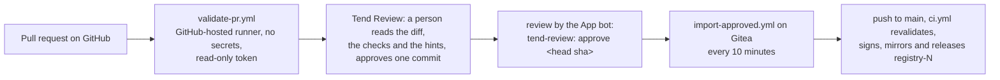

# How pull requests are reviewed and imported

This repository's source of truth is a private Gitea server; `main` is mirrored to GitHub, where contributors open
pull requests. Three pieces make a public pull request safe to review and, when approved, safe to publish.

## 1. Validation of untrusted pull requests

[`.github/workflows/validate-pr.yml`](../.github/workflows/validate-pr.yml) runs on `pull_request`, including from
forks. It is the only place in this project that runs a stranger's JavaScript (`bun test tests/js`) and Python
tests, so:

- it runs on a GitHub-hosted, throw-away runner, never on the self-hosted runner that signs releases;
- it has no secrets, `permissions: contents: read` and nothing else, never `pull_request_target`, and every action
  is pinned to a full commit SHA; `tests/test_workflows.py` fails if any of this changes;
- the tooling that judges the pull request (`tools/`) is checked out from the **base** commit, so a pull request
  cannot edit the validators that grade it. Changes to `tools/`, `scripts/`, workflows, `keys/`, `templates/`,
  `docs/` and the Python tests are maintainer-only and are reported as errors;
- it runs `tools/build.py` (manifests, integrity, glyphs, themes, recipes), `tools/validate_recipe.py`, `pytest`
  and `bun test`, and `tools/review_hints.py`, which annotates added lines that deserve a human's first look
  (`eval`, `new Function`, `fetch`/`WebSocket`, `importScripts`, `document.cookie`, remote or computed imports,
  minified files, markup that can run code, new permissions). Hints are warnings, never verdicts.

The result is the job's own check on the pull request plus annotations and a step summary. A fork's token cannot
write to the repository, so there is no separate check-run writer and nothing for the pull request to steal.
This workflow cannot run the panel's own installer (that needs the private core); Gitea does, when an approved pull
request lands on `main`.

## 2. Approval

A reviewer approves in Tend Review (a GitHub App on this repository: read pull requests and contents, write pull
request comments and checks). Approving posts a review as the App's bot account with the exact body
`tend-review: approve <40-hex head sha>`. A review by anyone else, in any other wording, or for another sha is
ignored. Pushing a new commit to the pull request voids the approval: the importer compares the sha, so nothing
that was not reviewed can be imported. Posting `tend-review: withdraw` voids it too.

## 3. Import

[`.gitea/workflows/import-approved.yml`](../.gitea/workflows/import-approved.yml) runs `tools/import_approved.py`
from the trusted checkout of `main` every 10 minutes (or on demand; `dry_run` reports without changing anything):

1. it lists open pull requests and takes those with a valid approval for their current head;
2. it fetches the pull request's commits as git objects only, and refuses it if it touches anything outside
   `extensions/`, `recipes/<slug>/` and `tests/js/`, adds a symlink or submodule, or does not rebase cleanly;
3. it rebases onto `main` (authors are kept), runs `tools/build.py` over the result, and refuses if the build fails
   or would rewrite a committed file (run the build locally and commit the integrity map);
4. it pushes to `main` without force. `ci.yml` then revalidates against the pinned panel core, mirrors, signs and
   releases. It comments the release tag the change ships in and closes the pull request;
5. refusals are commented once per head and reason. Nothing is retried blindly: a retried run finds the commits
   already on `main`, comments and closes.

The importer never holds a signing key, and Tend Review never holds a credential for this repository.

## Operator setup (one time)

1. **GitHub App "Tend Review"** on `Tend-Stack`, installed on `Tend-Stack/TendExtensions` only. Repository
   permissions: Pull requests read and write (comments and reviews), Contents read, Checks read; Metadata read. No
   webhook, no other permission, no organisation permission.
2. **GitHub mirror**: keep it read-only for people (only the publish job pushes to `main`); the supported path to
   `main` is the Gitea import above. Enable "Require approval for all outside collaborators" for Actions runs on
   fork pull requests, so a first-time contributor's workflow run starts only after a maintainer clicks approve.
3. **Gitea repository secrets and variables**: secret `IMPORT_PUSH_TOKEN` (a Gitea token able to push to `main` and
   to start `ci.yml`; a push with the job's own token does not), the existing `GH_PUBLISH_TOKEN` (add
   *Pull requests: write* so the importer can comment and close; without it imports still work and PRs stay open),
   variable `TEND_REVIEW_APP_LOGIN` (the App's bot login, e.g. `tend-review[bot]`).
4. **Community catalog key**: generate a key pair with `go run ./cmd/tend-sign-catalog keygen ./tend-catalog` in the
   private core, store `tend-catalog.key` (PEM) as secret `TEND_COMMUNITY_CATALOG_SIGNING_KEY`, keep an offline
   backup, and publish `tend-catalog.pub` as the site's `/.well-known/tend-catalog-pubkey`. Until the secret exists
   the release carries the registry alone and no catalog.
5. **Core pin**: the pinned `CORE_COMMIT` in `ci.yml` keeps working unchanged. A core `cmd/tend-validate-recipe`
   command (the panel's own `Entry.Normalize` and feed parser over each recipe) can be added to the Gitea job later
   as the authoritative check; the public validator here already enforces the contract without it.
6. **Refresh `tools/data/builtin-slugs.txt`** whenever the first-party catalog gains an app.
